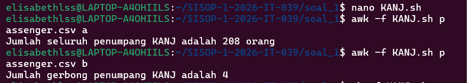
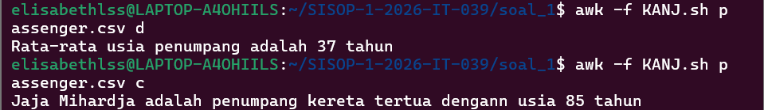
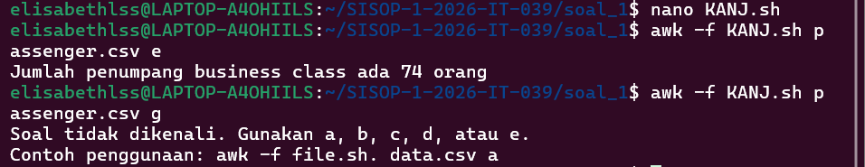
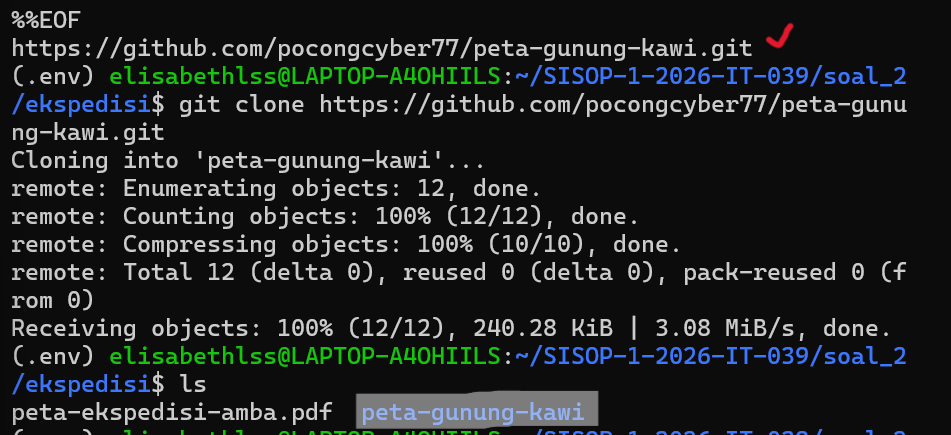
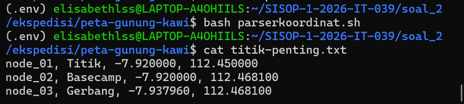
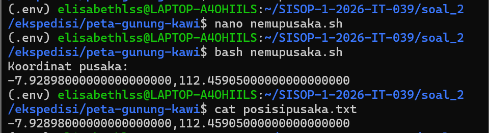

# SISOP-1-2026-IT-039

## Laporan Resmi Modul 1 Sisop oleh Elisabeth L. S. S. | 039

### Soal 1
### Penjelasan
Soal meminta kita untuk membantu menganalisis data penumpang KANJ (Kereta Argo Ngawi Jesgejes) menggunakan cmd Linux dan bantuan awk. Beberapa hal yang diminta adalah,

  a. Total penumpang KANJ hari itu  
  b. Jumlah gerbong yang beroperasi hari itu  
  c. Menemukan siapa penumpang tertua di KANJ hari itu  
  d. Rata-rata usia penumpang KANJ hari itu  
  e. Banyaknya penumpang business class KANJ hari itu
  (+) Pesan untuk contoh penulisan command

#### Menginisiasi kode dengan BEGIN
```
BEGIN {FS = ","
        choice = ARGV[2]
        ARGV[2] = ""
        age = 0
      }
```
: `BEGIN` digunakan untuk mempersiapkan variabel yang nanti akan digunakan.  
: `FS` adalah Field Separator, artinya file `passenger.csv` akan dibaca berdasarkan tanda koma (,).  
: `choice = ARGV[2]` berarti mengambil array kedua dari command di terminal, yang artinya adalah pilihan analisis kita (a-e).  
: `ARGV[2] = ""` dibuat kosong agar tidak error karena nanti sistem akan membaca array kedua sebagai file bukan input.  
: `age` diinisiasi sebagai 0 menjadi umur tertinggi untuk sementara.

#### a. Total penumpang KANJ hari itu
```
NR > 1 {
  if (choice == "a") {
    count++
  }
```

: `NR > 1` artinya untuk Nomor Baris lebih dari 1, dan akan dijalankan untuk tiap pemilihan input (a-e), karena NR = 1 adalah header kategori maka tidak diikutsertakan ke proses analisis.  
: Jika `choice = a`, maka setiap baris data variabel `count` akan melakukan increment berarti akhir baris adalah jumlah penumpang KANJ.

#### b. Jumlah gerbong yang beroperasi hari itu 
```
NR > 1 {
  ...
  if (choice == "b") {
    gerbong[$4] = 1
  }
```

: `[$4]` artinya kolom ke-4 di `passenger.csv` yang merupakan kolom gerbong.  
: Jika `choice = b`, maka array gerbong akan menghitung tiap jumlah gerbong unik.

#### c. Menemukan siapa penumpang tertua di KANJ hari itu
```
NR > 1 {
  ...
  if (choice == "c") {
    if ($2 > age) {
      age = $2
      oldest = $1
      }
  }
```

: `$2` artinya kolom ke-2 di `passenger.csv` yang merupakan kolom usia.  
: `$1` artinya kolom ke-1 di `passenger.csv` yang merupakan kolom nama penumpang.  
: Jika `choice = c`, maka akan masuk ke situasi looping selanjutnya jika `$2 > age`, maka variabel `age` akan menyimpan `$2` tersebut dan variabel `oldest` akan menyimpan nama penumpang sesuai array yang sedang di-screening.

#### d. Rata-rata usia penumpang KANJ hari itu 
```
NR > 1 {
  ...
  if (choice == "d") {
    sum += $2
    count++
  }
```

: Jika `choice = d`, maka variabel `sum` akan menyimpang jumlah `$2` dan variabel `count` akan menyimpan banyak data yang ada.  
: Nanti akan dipakai untuk penghitungan rata-rata di bagian `END`.

#### e. Banyaknya penumpang business class KANJ hari itu
```
NR > 1 {
  ...
  if (choice == "e") {
    if ($3 == "Business") {
      business++
    }
  }
}
```

: Jika `choice = e`, maka akan terjadi looping jika `$3` berisi "Business", maka variabel `business` akan increment dan menghasilkan jumlah kelas "Business" yang ada.

#### Bagian END
```
END {
    if (choice == "a") {
      print "Jumlah seluruh penumpang KANJ adalah " count " orang"
    }
    else if (choice == "b") {
      for (i in gerbong) jumlah++
      print "Jumlah gerbong penumpang KANJ adalah " jumlah
    }
    else if (choice == "c") {
      print oldest " adalah penumpang kereta tertua dengan usia " age " tahun"
    }
    else if (choice == "d") {
      if (count > 0) {
        average = int(sum/count)
        print "Rata-rata usia penumpang adalah " average " tahun"
      }
    }
    else if (choice == "e") {
      print "Jumlah penumpang business class ada " business " orang"
    }
    else {
      print "Soal tidak dikenali. Gunakan a, b, c, d, atau e."
      print "Contoh penggunaan: awk -f file.sh data.csv a"
    }
}
```

: Bagian `END` dijalankan setelah seluruh isi file sudah dibaca, dijadikan tempat memberikan output.  

### Output
#### 1. a dan b



#### 2. c dan d



#### 3. e dan pesan



### Soal 2
### Penjelasan

Soal ini meminta kita untuk membantu ekspedisi Mas Amba dalam menelusuri titik-titik penting di peta gunung kawi. Yang perlu dicari adalah:

a. Titik penting  
b. Posisi pusaka

#### 1. Menemukan git peta-gunung-kawi

Untuk mendapatkan git peta-gunung-kawi, kita perlu mendownload `peta-ekspedisi-amba.pdf` terlebih dahulu menggunakan `gdown`. Setelah itu mencari link github petanya, untuk diclone.



Setelah ter-clone, di dalam folder `peta-gunung-kawi` akan ada file `gsxtrack.json` yang dipakai untuk menentukan `titik-penting.txt`.

#### a. Parser Koordinat & Titik Penting

Titik penting ini dapat ditemukan dari mencarinya di `Parser Koordinat`. Jadi, langkah yang perlu dilakukan adalah...

```
nano parserkoordinat.sh
```
```
#!/bin/bash

grep -E '"site_name"|"latitude"|"longitude"' gsxtrack.json \
| sed 's/[",]//g' \
| awk '
/site_name/ {name = $2}
/latitude/ {lati = $2}
/longitude/ {long = $2
              printf "node_%02d, %s, %s, %s\n", ++i, name,
              lati, long}' > titik-penting.txt
```

: Script ini dijalankan dengan `bash`  
: Memakai `grep` untuk hanya mencari baris yang mengandung `"site_name"`, `"latitude"`, `"longitude"` dari file `gsxtrack.json`.  
: Memakai extended regex `-E` untuk menggunakan operator `|` (OR).  
: Memakai `sed` untuk membersihkan/menghapus karakter `"` dan `,` di hasil grep nanti.  
: Memakai `awk` untuk mengolah datanya,  
  * `/site_name/ {name = $2}` artinya saat bertemu `site_name`, ambil `$2` nya dan simpan ke variabel `name`.
  * `/latitude/ {lati = $2}` artinya saat bertemu `latitude`, ambil `$2` nya dan simpan ke variabel `lati`.
  * `/longitude/ {long = $2  printf "node_%02d, %s, %s, %s\n", ++i, name,
              lati, long}' > titik-penting.txt`, artinya saat bertemu `longitude`, ambil `$2` nya dan simpan ke variabel `long`. Selanjutnya untuk `output`, akan diprint `"node_2 digit, string nama, string lati, string long"` dilakukan otomatis melalui `++i`, dan hasilnya akan dimasukkan ke file `titik-penting.txt`.

### Output


#### b. Nemu Pusaka & Posisi Pusaka

Selanjutnya untuk menemukan titik tengah `Posisi Pusaka`, kita perlu menjalankan script `Nemu Pusaka` yang datanya akan diambil dari file `titik-penting.txt`. Langkah yang perlu dilakukan adalah...

```
nano nemupusaka.sh
```
```
#!/bin/bash

lati1=$(awk -F',' 'NR == 1 {print $3}' titik-penting.txt)
long1=$(awk -F',' 'NR == 1 {print $4}' titik-penting.txt)

lati2=$(awk -F',' 'NR == 3 {print $3}' titik-penting.txt)
long2=$(awk -F',' 'NR == 3 {print $4}' titik-penting.txt)

mid_lati=$(echo "$lati1 + $lati2)/2" | bc -l)
mid_long=$(echo "$long1 + $long2)/2" | bc -l)

echo "$mid_lati, $mid_long" > posisipusaka.txt

echo "Koordinat pusaka:"
cat posisipusaka.txt
```

: `-F` sebagai field separator yang memisahkan data tiap `,` (koma).  
: `lati1` artinya untuk `NR = 1` (baris pertama), ambil `$3` yaitu `latitude`.  
: `long1` artinya untuk `NR = 1` (baris pertama), ambil `$4` yaitu `longitude`.  
: `lati2` artinya untuk `NR = 3` (baris ketiga), ambil `$3` yaitu `latitude`.  
: `long2` artinya untuk `NR = 3` (baris ketiga), ambil `$4` yaitu `longitude`  
: Selanjutnya menghitung titik tengahnya dengan rumus titik tengah persegi. Ada penggunaan `bc -l` karena bash script tidak bisa *float*.  
: Hasil mid point latitude & mid point longitude akan dimasukkan ke `posisipusaka.txt`.

### Output


